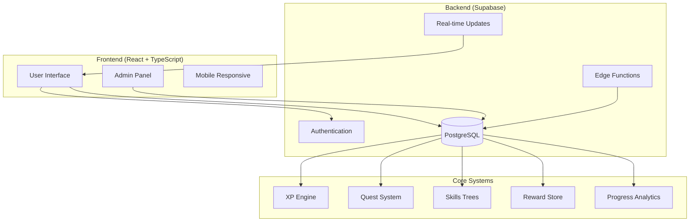
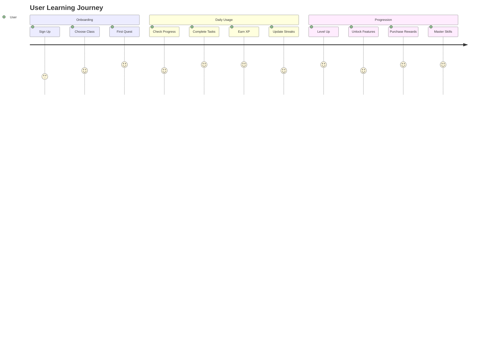

# GrindQuest Documentation

Welcome to the comprehensive documentation for **GrindQuest** - a gamified AI learning platform that transforms learning and work into an engaging, RPG-like experience.

## 📋 Documentation Overview

This documentation provides a complete understanding of GrindQuest's architecture, design, and implementation. Use these diagrams and guides to understand how the system works or to onboard new developers.

### 🗂️ Documentation Structure

| Document | Purpose | Target Audience |
|----------|---------|-----------------|
| **[Database Schema](./database-schema.md)** | Complete database design and relationships | Developers, DBAs |
| **[Application Architecture](./application-architecture.md)** | Technical stack and component structure | Developers, Architects |
| **[User Journey Flows](./user-journey-flows.md)** | How users interact with the system | Developers, Designers, PMs |
| **[XP & Gamification System](./xp-gamification-system.md)** | Detailed gamification mechanics | Developers, Game Designers |

## 🎮 What is GrindQuest?

GrindQuest is a **gamified learning platform** that transforms AI-adjacent learning and GenAI work into an engaging, game-like experience. Users earn XP, complete quests, level up, and unlock rewards while building real expertise.

### Core Concept
```
Real Learning + RPG Mechanics = Sustained Motivation
```

## 🏗️ System Architecture Summary



## 🎯 Key Features

### **For Learners**
- **🎮 RPG-Style Progression**: Levels, XP, skill trees
- **🎯 Quest System**: Structured learning objectives
- **📊 Progress Tracking**: Visual progress indicators
- **🏆 Rewards Store**: Real-world incentives
- **🔥 Streak System**: Habit formation mechanics
- **📈 Analytics**: Personal learning insights

### **For Administrators**
- **⚙️ Quest Management**: Create, edit, delete quests
- **🌳 Skills Management**: Manage skill trees and progression
- **🏪 Store Management**: Configure rewards and pricing
- **👥 User Management**: Oversee user progress and permissions
- **📋 Audit Logging**: Complete activity tracking
- **🔧 Rules Engine**: Configure XP calculations

## 🗄️ Database Design Highlights

### **Core Tables**
- **`profiles`**: User profiles and class selection
- **`quests`**: Learning objectives with XP rewards
- **`skills`**: Hierarchical skill trees
- **`xp_transactions`**: Complete XP audit trail
- **`rewards`**: Store items with prerequisites

### **Key Design Patterns**
- **UUID Primary Keys** for security and scalability
- **Row Level Security** for data isolation
- **JSON Configuration** for flexible business rules
- **Generated Columns** for computed values
- **Audit Trail** for compliance and debugging

## 💻 Tech Stack

### **Frontend**
- **React 18** + **TypeScript** for type-safe UI development
- **Vite** for fast development and building
- **TanStack Query** for server state management
- **Tailwind CSS** + **shadcn/ui** for beautiful, accessible components
- **React Router v6** for client-side routing

### **Backend**
- **Supabase** as Backend-as-a-Service
- **PostgreSQL** with advanced features (JSON, functions, triggers)
- **Row Level Security** for authorization
- **Real-time subscriptions** for live updates

### **Development**
- **ESLint** + **TypeScript ESLint** for code quality
- **PostCSS** for CSS processing
- **React DevTools** for debugging

## 🎮 Gamification Mechanics

### **XP System**
```
Base XP × Difficulty × Class Alignment × Novelty × Social Proof = Final XP
```

**Base XP Values:**
- Read documentation: **5 XP**
- Complete tutorial: **20 XP**
- Ship MVP: **50 XP**
- Close pilot project: **120 XP**

**Multipliers:**
- **Difficulty**: Easy (1.0x), Medium (1.2x), Hard (1.5x)
- **Class Alignment**: +20% bonus
- **Novelty**: +10% for first-time combinations
- **Social Proof**: +10% with evidence URL

### **Level Progression**
```
Level N requires: 100 + 50×(N-1) total XP
```

### **Quest Types**
- **Primary**: Main learning path quests
- **Side**: Optional skill-building activities  
- **Boss**: Major milestone challenges
- **Weekly**: Consistency-building contracts

## 🔄 User Journey Overview



## 🛠️ Development Setup

### **Prerequisites**
- Node.js 18+
- Supabase account
- Git

### **Quick Start**
```bash
# Clone repository
git clone <repo-url>
cd grindquest

# Install dependencies
npm install

# Set up environment
cp .env.example .env
# Add your Supabase credentials

# Start development server
npm run dev
```

### **Database Setup**
1. Create Supabase project
2. Run migrations in order from `supabase/migrations/`
3. Set up admin users in `admins` table

## 📊 Key Metrics & Analytics

### **User Engagement**
- Daily active users
- XP earned per day/week
- Quest completion rates
- Streak lengths and freeze token usage

### **Learning Outcomes**
- Skills progression over time
- Quest type preferences
- Difficulty level preferences
- Evidence submission rates

### **System Performance**
- Page load times
- Database query performance
- Real-time update latency
- Error rates and user experience

## 🔐 Security & Privacy

### **Data Protection**
- **Row Level Security**: Database-level access control
- **Input Validation**: Zod schemas for all inputs
- **XSS Protection**: Proper data sanitization
- **Audit Logging**: Complete activity tracking

### **Authentication**
- **Supabase Auth**: Industry-standard authentication
- **Session Management**: Secure token handling
- **Admin Controls**: Role-based access control

## 🚀 Deployment

### **Production Checklist**
- [ ] Environment variables configured
- [ ] Database migrations applied
- [ ] Admin users set up
- [ ] SSL certificates installed
- [ ] Analytics configured
- [ ] Error monitoring enabled

### **Deployment Options**
- **Vercel/Netlify**: Static site hosting
- **Supabase**: Database and backend services
- **Custom Domain**: Professional branding

## 🤝 Contributing

### **Development Workflow**
1. Fork repository
2. Create feature branch
3. Follow TypeScript and ESLint guidelines
4. Write tests for new features
5. Submit pull request

### **Code Standards**
- **TypeScript**: Full type safety required
- **Component Structure**: Follow established patterns
- **Database**: Use proper RLS and audit logging
- **Documentation**: Update diagrams for architectural changes

## 📞 Support & Contact

### **Technical Issues**
- Check console logs for errors
- Verify Supabase connection
- Review database RLS policies
- Check admin permissions

### **Feature Requests**
- Document use case and requirements
- Consider impact on existing users
- Design for scalability
- Maintain gamification principles

## 🎯 Future Roadmap

### **Phase 1** (Current)
- ✅ Core XP system
- ✅ Quest management
- ✅ Admin panel
- ✅ User progression

### **Phase 2** (Planned)
- 🔄 Advanced analytics
- 🔄 Social features
- 🔄 Mobile optimization
- 🔄 Achievement system

### **Phase 3** (Future)
- 📋 Multi-user organizations
- 📋 Advanced integrations
- 📋 AI-powered recommendations
- 📋 Custom learning paths

---

This documentation provides a complete understanding of GrindQuest's architecture and implementation. For specific technical details, refer to the individual documentation files linked above. 