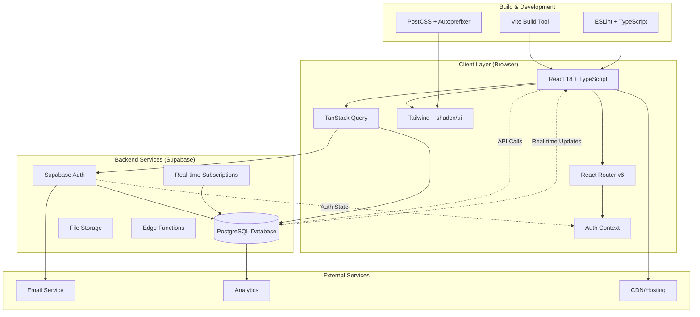
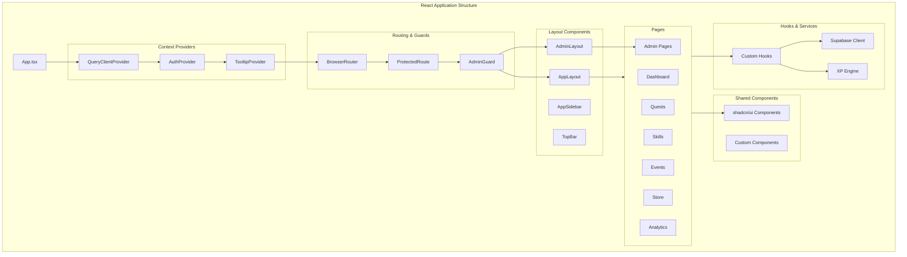
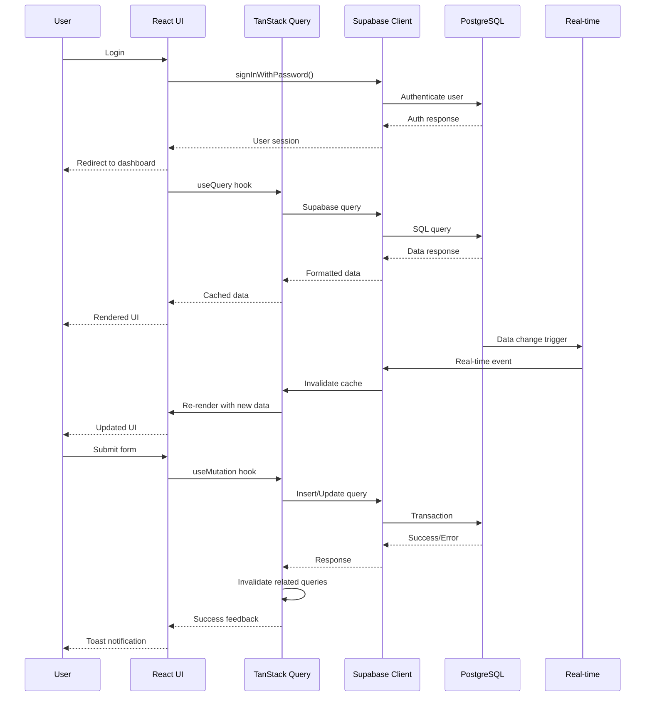
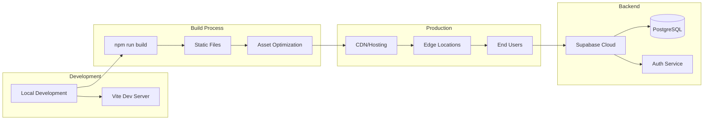

# GrindQuest Application Architecture

This document outlines the technical architecture of GrindQuest, showing how different layers and components interact to create the gamified learning platform.

## System Architecture Overview



## Frontend Architecture



## Tech Stack Details

### **Frontend Stack**

#### **Core Framework**
- **React 18**: Modern React with Concurrent Features
- **TypeScript**: Type safety and better developer experience
- **Vite**: Fast build tool and development server
- **React Router v6**: Client-side routing with nested routes

#### **State Management**
- **TanStack Query (React Query v5)**: Server state management
  - Caching, background updates, optimistic updates
  - Real-time synchronization with Supabase
- **React Context**: Auth state and global UI state
- **React Hook Form**: Form state management with validation

#### **UI & Styling**
- **Tailwind CSS**: Utility-first CSS framework
- **shadcn/ui**: High-quality React components built on Radix UI
- **Radix UI**: Unstyled, accessible UI primitives
- **Lucide React**: Modern icon library
- **Custom Design System**: Gaming-inspired theme with CSS variables

#### **Development Tools**
- **ESLint**: Code linting and formatting
- **TypeScript ESLint**: TypeScript-specific linting rules
- **PostCSS**: CSS processing with autoprefixer
- **React DevTools**: Development debugging

### **Backend Stack**

#### **Database & Backend**
- **Supabase**: Backend-as-a-Service platform
  - **PostgreSQL**: Relational database with JSON support
  - **Row Level Security (RLS)**: Database-level authorization
  - **Real-time subscriptions**: Live data updates
  - **Edge functions**: Server-side logic

#### **Authentication**
- **Supabase Auth**: Complete auth system
  - Email/password authentication
  - Session management
  - User management
  - Email verification

#### **Additional Services**
- **File Storage**: Profile pictures, evidence attachments
- **Email Service**: Transactional emails
- **Analytics**: Usage tracking and insights

## Data Flow Architecture



## Component Architecture Patterns

### **Page Structure Pattern**
```
Page Component
├── Custom Hooks (data fetching)
├── Local State (UI state)
├── Event Handlers (mutations)
├── UI Components
│   ├── Cards/Containers
│   ├── Forms/Inputs
│   ├── Tables/Lists
│   └── Modals/Dialogs
└── Loading/Error States
```

### **Hook Pattern**
```
Custom Hook
├── useQuery (data fetching)
├── useMutation (data modification)
├── Error Handling
├── Loading States
└── Cache Management
```

### **Component Composition**
- **Compound Components**: Dialog, Select, Form components
- **Render Props**: Flexible component composition
- **Higher-Order Components**: Authentication guards
- **Custom Hooks**: Reusable logic

## Key Design Principles

### **Performance**
- **Code Splitting**: Dynamic imports for pages
- **Lazy Loading**: Components loaded on demand
- **Memoization**: React.memo for expensive components
- **Optimized Queries**: Efficient database queries
- **Caching**: Aggressive caching with TanStack Query

### **Security**
- **Row Level Security**: Database-level access control
- **Type Safety**: TypeScript for compile-time safety
- **Input Validation**: Zod schemas for runtime validation
- **XSS Protection**: Proper data sanitization
- **CSRF Protection**: Supabase built-in protection

### **Scalability**
- **Modular Architecture**: Independent, reusable components
- **Database Functions**: Complex logic in PostgreSQL
- **Edge Functions**: Serverless scaling
- **CDN Integration**: Global content delivery
- **Real-time Optimization**: Efficient websocket usage

### **Developer Experience**
- **TypeScript**: Full type safety
- **Hot Reload**: Instant development feedback
- **Component Docs**: Self-documenting components
- **Consistent Patterns**: Standardized approaches
- **Error Boundaries**: Graceful error handling

## Deployment Architecture



This architecture provides a robust, scalable foundation for the gamified learning platform while maintaining excellent developer experience and performance. 