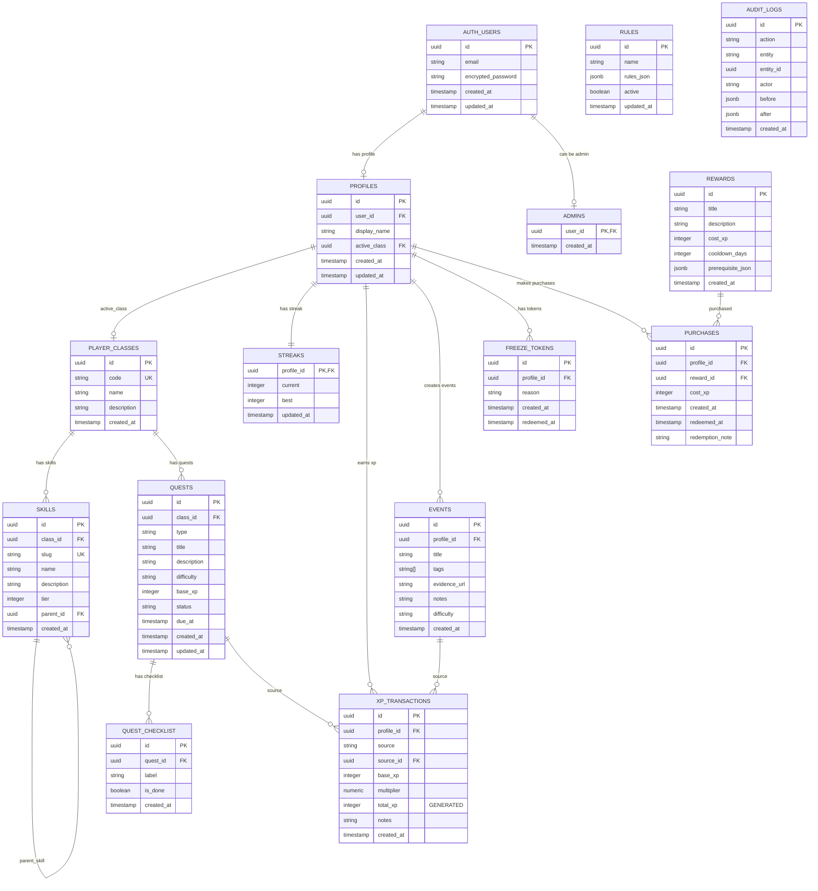

# GrindQuest Database Schema

This document provides a comprehensive overview of the GrindQuest database schema, showing all tables, relationships, and key constraints.

## Entity Relationship Diagram

## Table Descriptions

### **Core User Management**

#### `auth.users` (Supabase Auth)
- **Purpose**: Authentication and user accounts
- **Key Fields**: email, encrypted_password
- **Notes**: Managed by Supabase Auth

#### `profiles`
- **Purpose**: Extended user profile information
- **Key Fields**: display_name, active_class
- **Relationships**: Links to auth.users and player_classes
- **Notes**: Created automatically when user signs up

#### `admins`
- **Purpose**: Admin access control
- **Key Fields**: user_id (references auth.users)
- **Notes**: Simple table to grant admin privileges

### **Gaming System**

#### `player_classes`
- **Purpose**: Character classes (AI Backend, Copywriter, etc.)
- **Key Fields**: code (unique), name, description
- **Notes**: Defines different learning tracks

#### `skills`
- **Purpose**: Skills within each class
- **Key Fields**: name, slug, tier, parent_id
- **Relationships**: Belongs to class, can have parent skill
- **Notes**: Hierarchical skill tree structure

#### `quests`
- **Purpose**: Learning objectives and missions
- **Key Fields**: title, type, difficulty, base_xp, status
- **Types**: primary, side, boss, weekly
- **Status**: planned, active, paused, done

#### `quest_checklist`
- **Purpose**: Sub-tasks within quests
- **Key Fields**: label, is_done
- **Notes**: Allows breaking down quests into steps

### **Activity Tracking**

#### `events`
- **Purpose**: Custom user activities and achievements
- **Key Fields**: title, tags, evidence_url, difficulty
- **Notes**: User-created activity logging

#### `xp_transactions`
- **Purpose**: All XP gains and losses
- **Key Fields**: base_xp, multiplier, total_xp (computed)
- **Sources**: quest, event, reward_adjust, admin
- **Notes**: Complete audit trail of XP changes

### **Progression System**

#### `streaks`
- **Purpose**: Daily learning streak tracking
- **Key Fields**: current, best
- **Notes**: One record per user

#### `freeze_tokens`
- **Purpose**: Streak protection mechanism
- **Key Fields**: reason, redeemed_at
- **Notes**: Allows users to "freeze" streaks

### **Rewards System**

#### `rewards`
- **Purpose**: Store items purchasable with XP
- **Key Fields**: title, cost_xp, cooldown_days, prerequisite_json
- **Notes**: JSON prerequisites allow complex unlock conditions

#### `purchases`
- **Purpose**: Purchase history and redemption tracking
- **Key Fields**: cost_xp, redeemed_at, redemption_note
- **Notes**: Tracks both purchase and redemption

### **Configuration & Audit**

#### `rules`
- **Purpose**: XP calculation rules and multipliers
- **Key Fields**: rules_json, active
- **Notes**: JSON configuration for XP system

#### `audit_logs`
- **Purpose**: System activity audit trail
- **Key Fields**: action, entity, before, after
- **Notes**: Complete change history for compliance

## Key Design Patterns

### **UUID Primary Keys**
All tables use UUID primary keys for:
- Security (non-guessable IDs)
- Distributed system compatibility
- Better performance with large datasets

### **Soft References**
- XP transactions reference source entities via `source` + `source_id`
- Allows flexible XP sources without tight coupling

### **JSON Configuration**
- Rules and prerequisites stored as JSON
- Enables runtime configuration without schema changes
- Supports complex business logic

### **Audit Trail**
- Complete change history via audit_logs
- Before/after state capture
- Essential for debugging and compliance

### **Generated Columns**
- `total_xp` computed from `base_xp * multiplier`
- Ensures consistency and performance

## Database Functions

### **XP System Functions**
- `apply_xp()` - Applies XP with multipliers and rules
- `simulate_xp()` - Tests XP calculations
- `get_profile_stats()` - Real-time user statistics

### **Utility Functions**
- `is_admin()` - Admin permission checking
- `log_audit()` - Audit trail creation
- `get_total_xp_today/week()` - Aggregated statistics

This schema supports the complete gamification system while maintaining flexibility for future enhancements. 