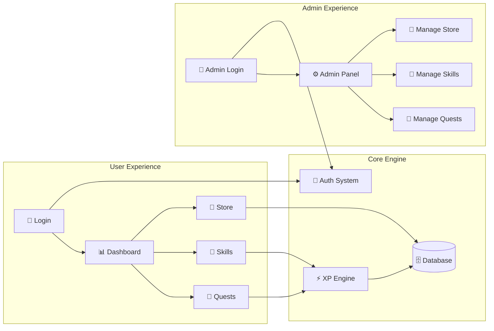
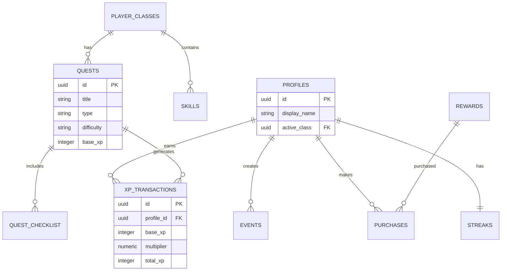
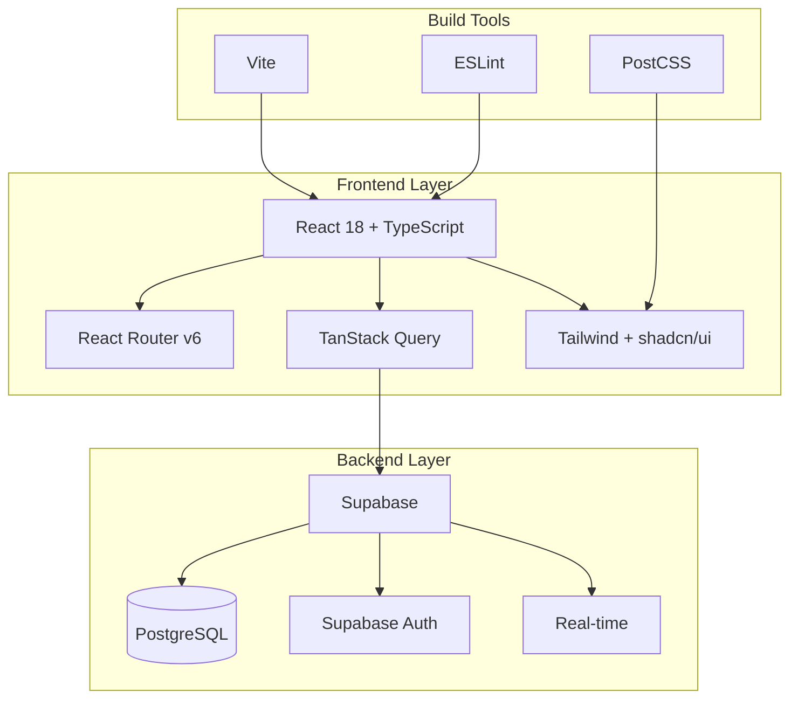
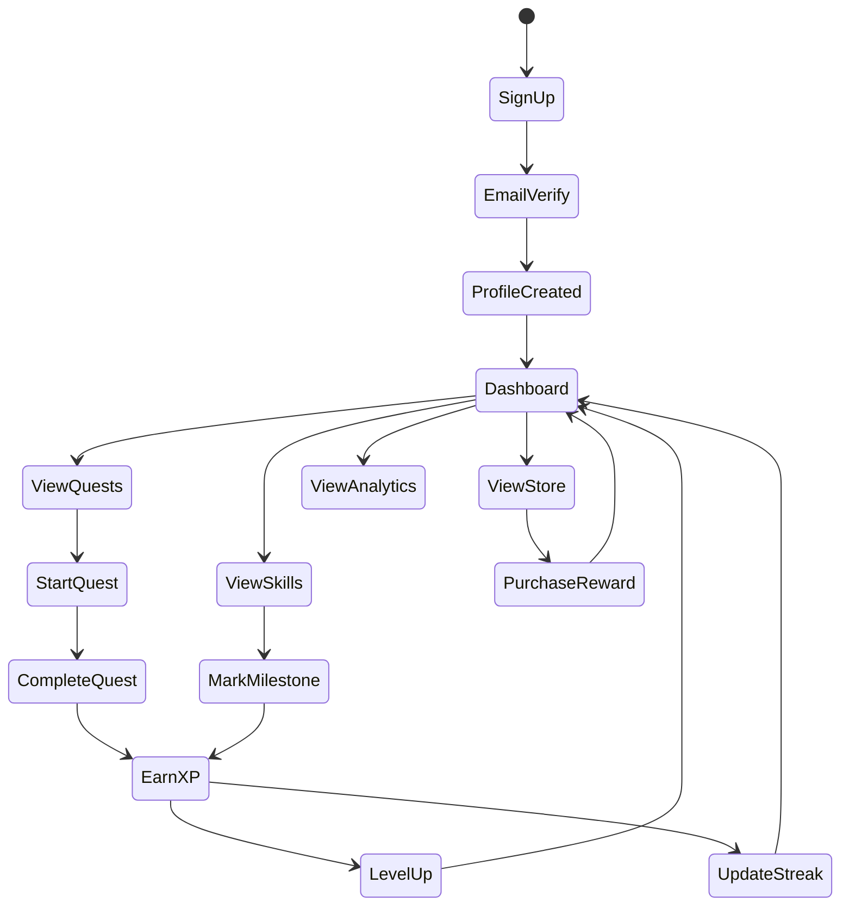

# GrindQuest Quick Reference

This document provides quick visual references for the most important aspects of GrindQuest for developers and stakeholders.

## System Overview at a Glance



## Database Tables Quick View



## XP Calculation Quick Formula

```
🎯 Base XP (varies by activity)
×  🎚️ Difficulty Multiplier (1.0x - 1.5x)
×  🎭 Class Alignment Bonus (1.0x - 1.2x)
×  ✨ Novelty Bonus (1.0x - 1.1x)  
×  📸 Social Proof Bonus (1.0x - 1.1x)
= 🏆 Final XP Awarded
```

### Example Calculations:
- **Simple Task**: 20 XP × 1.0 × 1.0 × 1.0 × 1.0 = **20 XP**
- **Aligned Medium Task**: 50 XP × 1.2 × 1.2 × 1.0 × 1.0 = **72 XP**
- **Perfect Storm**: 100 XP × 1.5 × 1.2 × 1.1 × 1.1 = **218 XP**

## Tech Stack Visual



## User Flow Quick Map



## Admin Capabilities Matrix

| Feature | Create | Read | Update | Delete | Notes |
|---------|:------:|:----:|:------:|:------:|-------|
| **Quests** | ✅ | ✅ | ✅ | ✅ | Full CRUD with checklist management |
| **Skills** | ✅ | ✅ | ✅ | ✅ | Tier-based with parent relationships |
| **Rewards** | ✅ | ✅ | ✅ | ✅ | XP pricing and prerequisites |
| **Users** | ❌ | ✅ | ⚠️ | ❌ | View and toggle admin status |
| **XP Rules** | ❌ | ✅ | ✅ | ❌ | Configure multipliers and calculations |
| **Audit Logs** | ❌ | ✅ | ❌ | ❌ | Read-only system activity |

**Legend**: ✅ Full Access | ⚠️ Limited Access | ❌ No Access

## File Structure Quick Reference

```
src/
├── components/
│   ├── admin/          # Admin panel components
│   ├── layout/         # App layout components  
│   └── ui/             # shadcn/ui components
├── contexts/
│   └── AuthContext.tsx # Authentication state
├── hooks/
│   ├── useProfile.ts   # User profile management
│   ├── useQuests.ts    # Quest operations
│   ├── useSkills.ts    # Skills operations
│   ├── useEvents.ts    # Event/activity logging
│   ├── useRewards.ts   # Store/rewards
│   └── useAdmin*.ts    # Admin operations
├── integrations/
│   └── supabase/       # Supabase client & types
├── lib/
│   ├── utils.ts        # Utility functions
│   └── xp/
│       └── engine.ts   # XP calculation logic
├── pages/
│   ├── admin/          # Admin pages
│   ├── Dashboard.tsx   # Main dashboard
│   ├── Quests.tsx      # Quest management
│   ├── Skills.tsx      # Skills tracking
│   ├── Events.tsx      # Activity logging
│   ├── Store.tsx       # Rewards store
│   └── Analytics.tsx   # Progress analytics
└── types/
    └── database.ts     # TypeScript types
```

## Environment Setup Checklist

### Development Setup
- [ ] Node.js 18+ installed
- [ ] Git configured
- [ ] Code editor with TypeScript support
- [ ] React DevTools browser extension

### Project Setup  
- [ ] Repository cloned
- [ ] `npm install` completed
- [ ] Environment variables configured
- [ ] Supabase project created
- [ ] Database migrations applied

### Admin Setup
- [ ] First user account created
- [ ] User added to `admins` table
- [ ] Admin panel access verified
- [ ] Sample quests/skills created

### Production Checklist
- [ ] Environment variables secured
- [ ] Database backups configured  
- [ ] Error monitoring enabled
- [ ] Analytics configured
- [ ] Domain and SSL configured

## Common Commands

```bash
# Development
npm run dev              # Start development server
npm run build           # Build for production
npm run preview         # Preview production build
npm run lint            # Run ESLint

# Database (Supabase CLI)
supabase start          # Start local Supabase
supabase db reset       # Reset local database
supabase gen types      # Generate TypeScript types

# Deployment
npm run build && npm run preview  # Test production build
```

## Troubleshooting Quick Fixes

### Common Issues
1. **Page not loading**: Check Supabase connection and RLS policies
2. **Admin access denied**: Verify user is in `admins` table
3. **Skills not showing**: Check player class assignment
4. **XP not calculating**: Verify database functions are deployed
5. **Real-time not working**: Check Supabase project settings

### Debug Steps
1. Check browser console for errors
2. Verify network requests in DevTools
3. Check Supabase logs
4. Validate user authentication state
5. Review database RLS policies

This quick reference provides the essential information needed to understand and work with GrindQuest efficiently. 