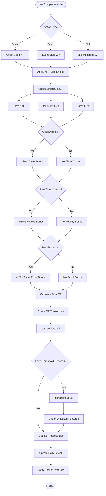

# GrindQuest User Journey Flows

This document illustrates the complete user experience flows within GrindQuest, from initial signup to advanced progression tracking.

## Complete User Journey Overview

## Authentication & Onboarding Flow

## Quest Completion Flow

## XP and Progression System Flow

## Skills Progression Flow

## Store & Rewards Flow

## Admin Management Flow

These user journey flows provide a comprehensive understanding of how users interact with GrindQuest at every level, from basic navigation to advanced progression mechanics and administrative functions. 