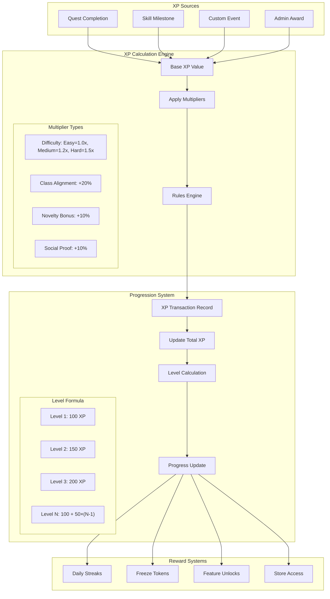
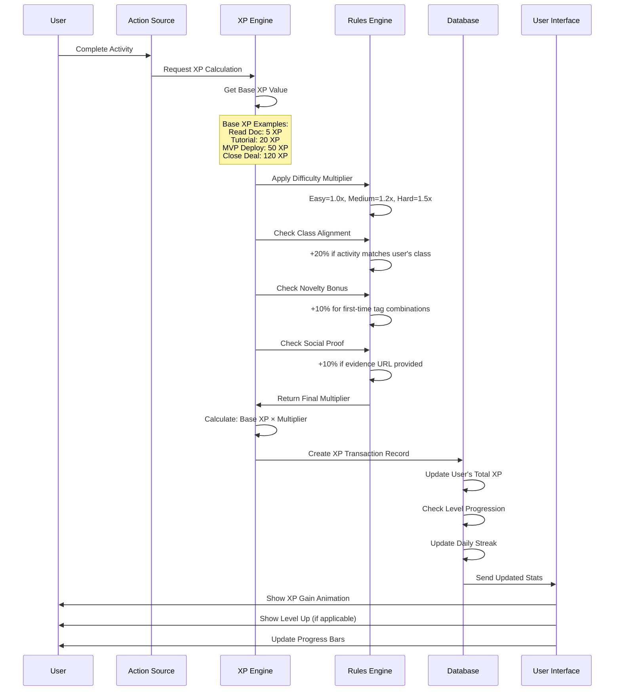
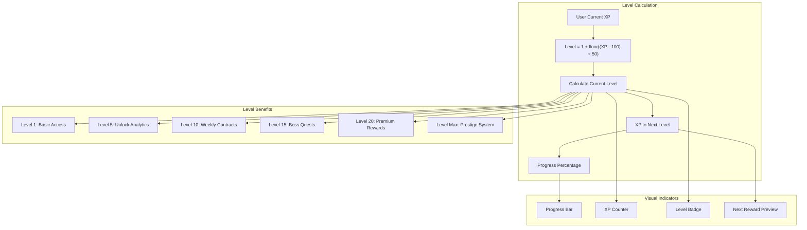
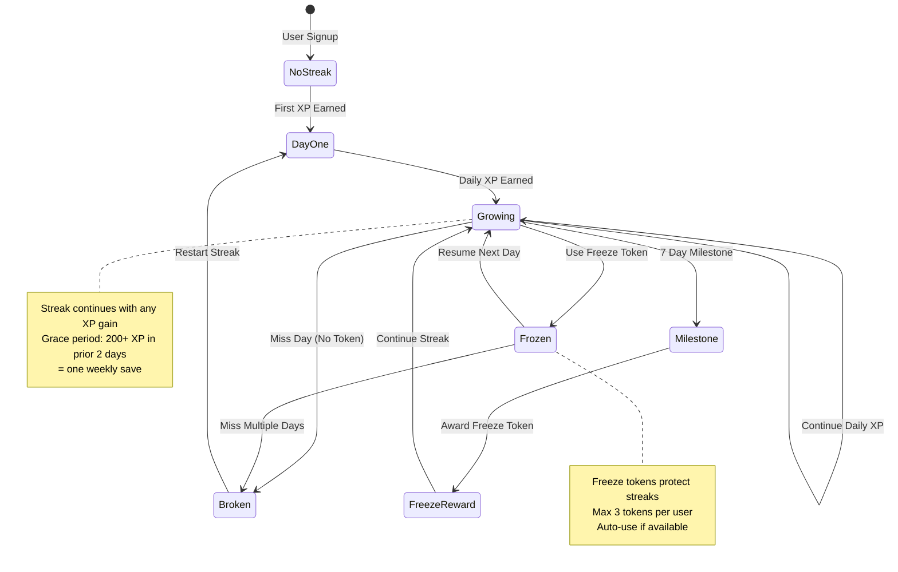
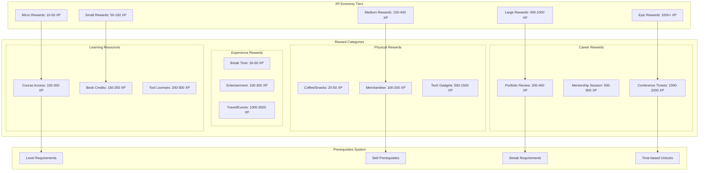
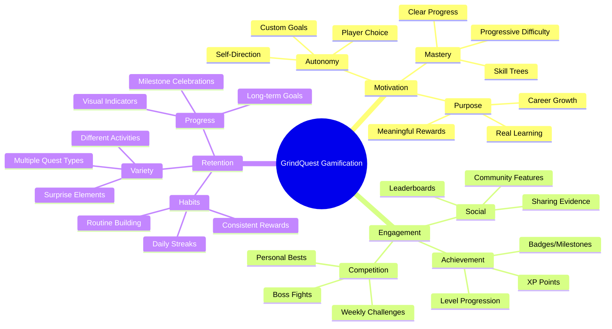
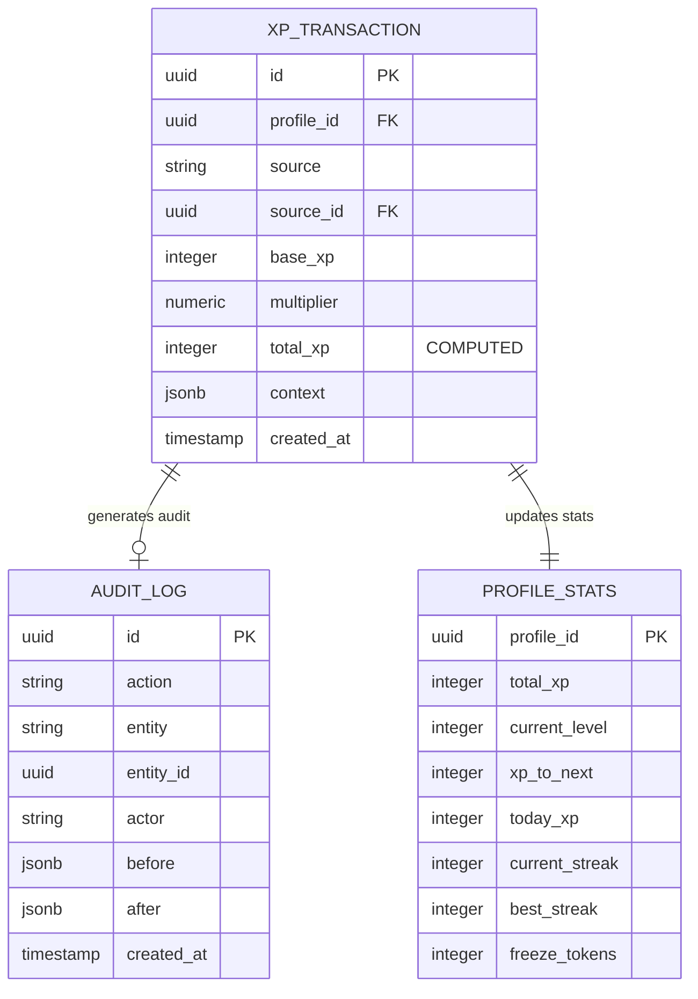
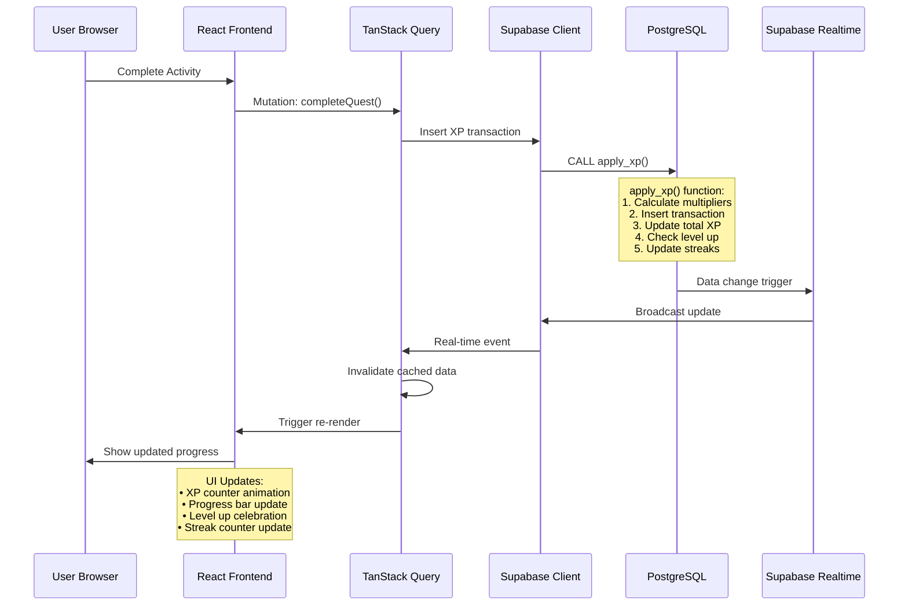

# GrindQuest XP & Gamification System

This document details the comprehensive XP (Experience Points) and gamification mechanics that drive user engagement and progression in GrindQuest.

## XP System Architecture

## Detailed XP Calculation Flow

## Level Progression System

## Streak System Mechanics

## Quest Type & Reward Structure

```mermaid
graph TB
    subgraph "Quest Types & XP Rewards"
        subgraph "Primary Quests"
            P1[Foundation Building: 20-50 XP]
            P2[Core Implementation: 50-80 XP]
            P3[Advanced Projects: 80-120 XP]
        end
        
        subgraph "Side Quests"
            S1[Quick Wins: 10-30 XP]
            S2[Skill Practice: 20-40 XP]
            S3[Community Engagement: 15-35 XP]
        end
        
        subgraph "Boss Fights"
            B1[Major Milestones: 100-200 XP]
            B2[Capstone Projects: 150-300 XP]
            B3[Challenge Quests: 200-500 XP]
        end
        
        subgraph "Weekly Contracts"
            W1[Consistency Goals: 30-60 XP]
            W2[Learning Targets: 40-80 XP]
            W3[Output Goals: 50-100 XP]
        end
    end
    
    subgraph "Multiplier Applications"
        ClassBonus[Class Aligned: +20%]
        DifficultyBonus[Hard Difficulty: +50%]
        NoveltyBonus[First Time: +10%]
        EvidenceBonus[With Proof: +10%]
        
        MaxMultiplier["Maximum: 1.5 × 1.2 × 1.1 × 1.1 = 2.178x"]
    end
    
    P1 --> ClassBonus
    S1 --> ClassBonus
    B1 --> DifficultyBonus
    W1 --> NoveltyBonus
    ClassBonus --> MaxMultiplier
    DifficultyBonus --> MaxMultiplier
    NoveltyBonus --> MaxMultiplier
    EvidenceBonus --> MaxMultiplier
```

## Store Economy & Rewards

## Gamification Psychology Elements

## XP Transaction Audit Trail

## Real-time Progress Updates

This comprehensive XP and gamification system creates a compelling loop of progression, achievement, and reward that keeps users engaged in their learning journey while providing clear feedback and motivation for continued growth. 